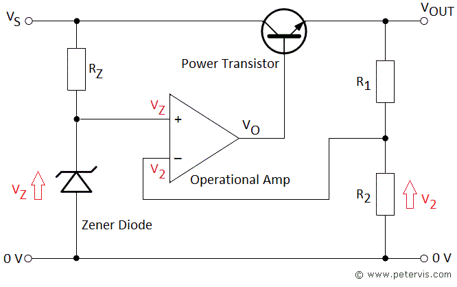

### Introduction
 

A voltage regulator is an integrated circuit (IC) that provides a constant fixed output voltage regardless of a change in the load or input voltage. It can do this many ways depending on the topology of the circuit within, but for the purpose of keeping this project basic, we will mainly focus on the linear regulator. A linear voltage regulator works by automatically adjusting the resistance via a feedback loop, accounting for changes in both load and input, all while keeping the output voltage constant. 

Electronic voltage regulators utilize solid-state semiconductor devices to smooth out variations in the flow of current. In most cases, they operate as variable resistances; that is, resistance decreases when the electrical load is heavy and increases when the load is lighter. 

 

<b>Figure 1. Voltage regulator using operational amplifier</b>
  
Voltage regulators find their applications in computers, alternators, power generator plants where the circuit is used to control the output of the plant. Voltage regulators may be classified as electromechanical or electronic. It can also be classified as AC regulators or DC regulators. 
All electronic voltage regulators will have a stable voltage reference source which is provided by the reverse breakdown voltage operating diode called zener diode. The main reason to use a voltage regulator is to maintain a constant dc output voltage. It also blocks the ac ripple voltage that cannot be blocked by the filter. A good voltage regulator may also include additional circuits for protection like short circuits, current limiting circuit, thermal shutdown, and overvoltage protection.

                    

