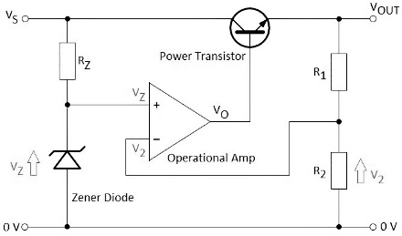

<h2>Introduction</h2>

A voltage regulator is an integrated circuit (IC) that provides a constant fixed output voltage regardless of a change in the load or input voltage. It can do this many ways depending on the topology of the circuit within, but for the purpose of keeping this project basic, we will mainly focus on the linear regulator. A linear voltage regulator works by automatically adjusting the resistance via a feedback loop, accounting for changes in both load and input, all while keeping the output voltage constant. 

Electronic voltage regulators utilize solid-state semiconductor devices to smooth out variations in the flow of current. In most cases, they operate as variable resistances; that is, resistance decreases when the electrical load is heavy and increases when the load is lighter. 

A voltage regulator circuit using an op amp, emitter follower transistor and Zener diode. These types of circuits provide better load regulation than a simple Zener diode and resistor alone. In addition, if you make R1 a variable resistor, then the output voltage could be varied for a large range of voltages. For this op amp circuit, we use the operational amplifier as a comparator and the two voltage levels that we are comparing are the regulated input reference, and final output. We should also remember that we use potential dividers (PD) to get a sample of the input and output voltages. As you can see, the input side consists of a Zener diode and resistor, and this arrangement is the same if you were to have a simple Zener diode regulator circuit.   The regulated output from the Zener diode and resistor network feeds the non-inverting input of the op amp. Engineers usually call this a reference voltage because it remains the same, even when the input voltage varies. The Zener diode obviously determines this fixed reference voltage across it, which we call VZ. The output voltage from the second PD consisting of R1 and R2 feeds the inverting input of the comparator. This voltage is V2, which we usually find using the simple PD formula. 

 

Fig. 1. Voltage regulator using operational amplifier
 

The two input voltages subtract as (VZ – V2), and the result value is the output VO from the op amp that drives a power transistor in emitter-follower configuration. 

<b>VO = A × (VZ – V2)</b>
 

In this formula, A is the open loop gain of the operational amplifier, which is usually 100000 for a 741-type device.

The final output voltage VOUT is (VO – 0.7V). As you can see, it is always 0.7V less because of the emitter-follower junctions.

Let us say that the output voltage VOUT begins to fall because of the loading across it. Then V2 across R2 also falls, and then the result of (VZ – V2) increases, and VO also increases, making the transistor conduct more, thereby increasing the output voltage. As you can see, the mechanism of this comparator circuit is such that it tries to make V2 approximately equal to VZ all the time. 

<b>V2 = Vout x R2/(R1+R2)</b>

Here is a simple PD formula showing V2 in terms of R1 and R2.

<b>V2 = VZ</b>
 

Since, the op amp tries to make V2 and VZ the same by compensating the output, we can write the following expression.

<b>VZ = Vout x R2/(R1+R2)</b>

By substitution, we derive this expression for VZ.

<b>VZ x (R1 + R2) = Vout x R2</b>
 

Here, we rearrange for Vout.

<b>Vout = VZ x (R1+R2)/R2</b>
 

<b> = VZ x (R1/R2 + R2/R2)</b>
 

<b>Vout = VZ x (R1/R2 + 1)</b>

### Advantages Of Voltage Regulator

1. It is very simple to implement and easy to use.
2. It gives low output ripple voltage.
3. It has a fast response time to load.
4. It has less noise and low electromagnetic interference.
5. It is more cost-efficient.

### Disadvantages Of Voltage Regulator

1. Its efficiency of it is relatively low.
2. It gives the output voltage always less than the input voltage i.e., it performs only step down operation.
3. It requires a heat sink since it dissipates excess power as heat and becomes extremely hot during regulation.
4. It requires large spaces.

### Applications Of Voltage Regulator

1. One of the most common examples is the mobile charger. The adapter is supplied with an AC signal. However, the output voltage signal is a regulated DC signal.
2. Every power supply in the world uses a voltage regulator to provide the desired output voltage. Computers, televisions, laptops, and all sorts of devices are powered using this concept.
3. Small electronic circuits rely on regulators to operate. Even the slightest fluctuation in voltage signal can damage the components of a circuit such as ICs.
4. When it comes to power generation systems, voltage regulators play an essential part in their operation. A solar power plant generates electricity based on the intensity of sunlight. It needs a regulator to ensure a regulated constant output signal.

